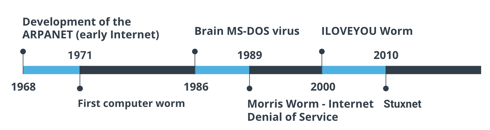
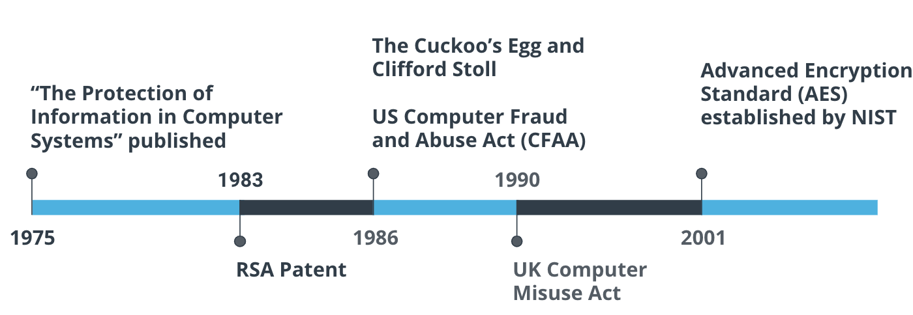
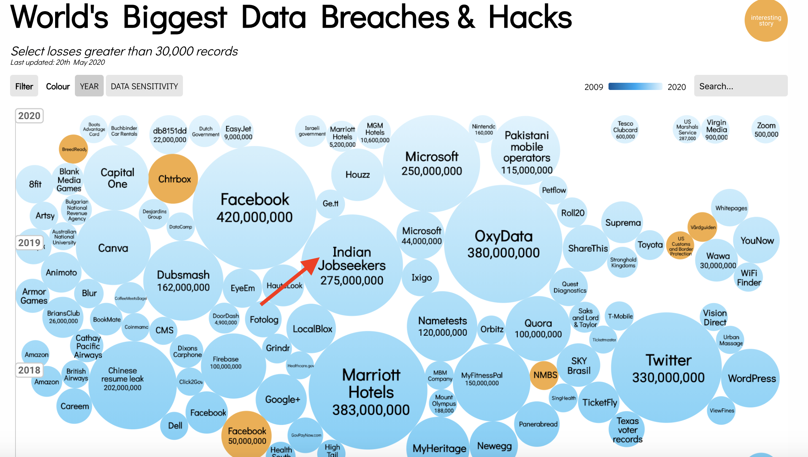
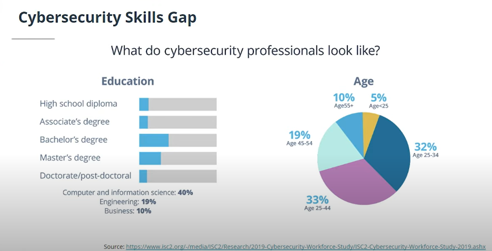
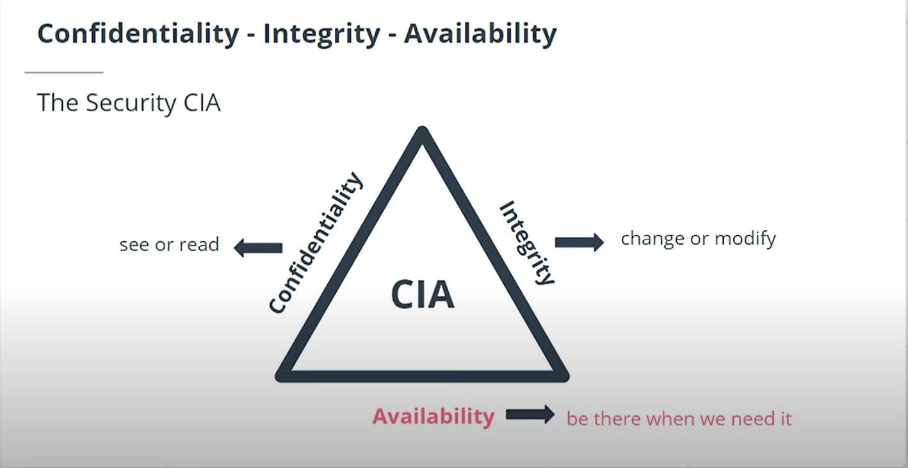

# Cybersecurity

# History of Computer Viruses and Worms

With the start of the Internet in the late 1960s, known then as the ARPANET came a need to secure the data, connections, and computer systems for those using it; mostly research institutions, universities, and governments. Computers in the early days of the Internet often didn’t have basic protection and used telephone modems to dial-into the network. Highlights of memorable computer viruses and worms include:

- 1968 - Development of the ARPANET (early Internet)
- 1971 - First reported computer worm - Creeper
         - It didn't affect any computer but it displays message on screen stating,"I am a creeper , catch me if you can"
- 1986 - Brain MS-DOS virus
- 1989 - Morris Worm - Internet Denial of Service
- 2000 - ILOVEYOU Worm  ( written in VB script using social engineering infected millions within hour of realese)
- 2010 - Stuxnet

# Timeline of Computer Viruses, Mapcon

- 1975 - “The Protection of Information in Computer Systems” published
- 1983 - RSA Patent
- 1986 - The Cuckoo’s Egg and Clifford Stoll
- 1986 - US Computer Fraud and Abuse Act (CFAA)
- 1990 - UK Computer Misuse Act
- 2001 - Advanced Encryption Standard (AES) established by NIST

***In September of 1983 when MIT was granted a patent that introduced the RSA (Rivest-Shamir-Adleman) algorithm, which was one of the first public key cryptosystems***

# Security Trends

* **Phishing**: A technique for attempting to acquire sensitive data, such as bank account numbers, through a fraudulent solicitation in email or on a web site, in which the perpetrator masquerades as a legitimate business or reputable person.   
* **Malware**: Software or firmware intended to perform an unauthorized process that will have an adverse impact on the confidentiality, integrity, or availability of an information system. A virus, worm, Trojan horse, or other code-based entity that infects a host. Spyware and some forms of adware are also examples of malicious code.    
* **Ransomware**: A type of malicious software designed to block access to a computer system until a sum of money is paid.    
* **Business Email Compromise**: An exploit in which an attacker obtains access to a business email account and imitates the owner's identity, in order to defraud the company and its employees, customers or partners.    
* **Internet of Things**: The interconnection via the Internet of computing devices embedded in everyday objects, enabling them to send and receive data.

   

[World Biggest Data breaches visulization](https://informationisbeautiful.net/visualizations/worlds-biggest-data-breaches-hacks/)

From the 2020 Verizon Data Breach Investigations Report:

- 70% of attacks were perpetrated by outsiders and 34% involved internal actors.
- 45% of breaches featured Hacking, 22% included social attacks, and 17% involved malware. 86% of the breaches were financially motivated
- 72% of victims were large businesses and 28% were small businesses.  
***Even though these values change over time, the general concepts have remained steady. Take time to understand this report as it's used throughout the cybersecurity industry.***

# Cybersecurity Skills Gap
- 66 % say it's difficult to retain cybersecurity talent

Link for the website:  
[Cybersecurity pathways](https://www.cyberseek.org/pathway.html)

# Security Principles

* Economy of mechanism -> Economy of Mechanism means to keep things small and simple.
* Fail-safe defaults
* Complete mediation
* Open design
* Separation of privilege
* Least privilege
* Least common mechanism
* User-friendly interface    

