# Cybersecurity

# History of Computer Viruses and Worms

With the start of the Internet in the late 1960s, known then as the ARPANET came a need to secure the data, connections, and computer systems for those using it; mostly research institutions, universities, and governments. Computers in the early days of the Internet often didn’t have basic protection and used telephone modems to dial-into the network. Highlights of memorable computer viruses and worms include:

- 1968 - Development of the ARPANET (early Internet)
- 1971 - First reported computer worm - Creeper
         - It didn't affect any computer but it displays message on screen stating,"I am a creeper , catch me if you can"
- 1986 - Brain MS-DOS virus
- 1989 - Morris Worm - Internet Denial of Service
- 2000 - ILOVEYOU Worm  ( written in VB script using social engineering infected millions within hour of realese)
- 2010 - Stuxnet

# Timeline of Computer Viruses, Mapcon

- 1975 - “The Protection of Information in Computer Systems” published
- 1983 - RSA Patent
- 1986 - The Cuckoo’s Egg and Clifford Stoll
- 1986 - US Computer Fraud and Abuse Act (CFAA)
- 1990 - UK Computer Misuse Act
- 2001 - Advanced Encryption Standard (AES) established by NIST

***In September of 1983 when MIT was granted a patent that introduced the RSA (Rivest-Shamir-Adleman) algorithm, which was one of the first public key cryptosystems***

# Security Trends

* **Phishing**: A technique for attempting to acquire sensitive data, such as bank account numbers, through a fraudulent solicitation in email or on a web site, in which the perpetrator masquerades as a legitimate business or reputable person.   
* **Malware**: Software or firmware intended to perform an unauthorized process that will have an adverse impact on the confidentiality, integrity, or availability of an information system. A virus, worm, Trojan horse, or other code-based entity that infects a host. Spyware and some forms of adware are also examples of malicious code.    
* **Ransomware**: A type of malicious software designed to block access to a computer system until a sum of money is paid.    
* **Business Email Compromise**: An exploit in which an attacker obtains access to a business email account and imitates the owner's identity, in order to defraud the company and its employees, customers or partners.    
* **Internet of Things**: The interconnection via the Internet of computing devices embedded in everyday objects, enabling them to send and receive data.

   

[World Biggest Data breaches visulization](https://informationisbeautiful.net/visualizations/worlds-biggest-data-breaches-hacks/)

From the 2020 Verizon Data Breach Investigations Report:

- 70% of attacks were perpetrated by outsiders and 34% involved internal actors.
- 45% of breaches featured Hacking, 22% included social attacks, and 17% involved malware. 86% of the breaches were financially motivated
- 72% of victims were large businesses and 28% were small businesses.  
***Even though these values change over time, the general concepts have remained steady. Take time to understand this report as it's used throughout the cybersecurity industry.***

# Cybersecurity Skills Gap
- 66 % say it's difficult to retain cybersecurity talent

Link for the website:  
[Cybersecurity pathways](https://www.cyberseek.org/pathway.html)

# Security Principles

* Economy of mechanism -> Economy of Mechanism means to keep things small and simple.
* Fail-safe defaults
* Complete mediation
* Open design
* Separation of privilege
* Least privilege
* Least common mechanism
* User-friendly interface    

   

# Rules Governing Cybersecurity
- In the United States, that organization is the National Institute of Standards and Technology, also known as NIST.   
- The International Organization for Standards or ISO works with the International Electrotechnical Commission or IEC to set worldwide technology standards.   
- There are also governing bodies that set the rules for specific areas. For example, the Payment Card Industry (PCI) has the Data Security Standards that are required for any business accepting or handling credit card data.   

# Governance and Compliance

- Governance - A strategic planning responsibility providing organizational oversight that sets policies and establishes practices to enforcement.   
- Compliance - Requirement all affected parties follow the same rules.   
- Audit - Independent review and examination of records and activities to assess the adequacy of system controls, to ensure compliance with established policies and operational procedures. (NIST Glossary)   

- Policies are the bedrock of a security program. Policies are: 
   - Formal statements, rules or assertions that specify the correct or expected behavior of an entity.
   - Example: Acceptable Use Policy (AUP)
   - Enforcement and compliance
   - Written and accessible

# Security Frameworks
## ISO 27000 Series

1. ISO/IEC 27002:2013, The Code of Practice for Information Security Management
2. ISO/IEC 27002:2013, The Code of Practice for Information Security Management  
   - 14 security control groups
   - 35 control objectives
   - More than 110 individual controls

3. ISO/IEC 27005:2011, ISMS Risk Management

# Industry-Specific Regulations
1. HIPAA Security and Privacy rules - Safeguarding Protected Health Information (PHI)
2. Payment Card Industry Data Security Standard (PCI DSS) - Rules for processing, storing or transmitting Cardholder Data
3. European Union’s General Data Privacy Regulation (GDPR) - EU’s law on data protection and privacy

# NIST Special Publications SP 800 Series
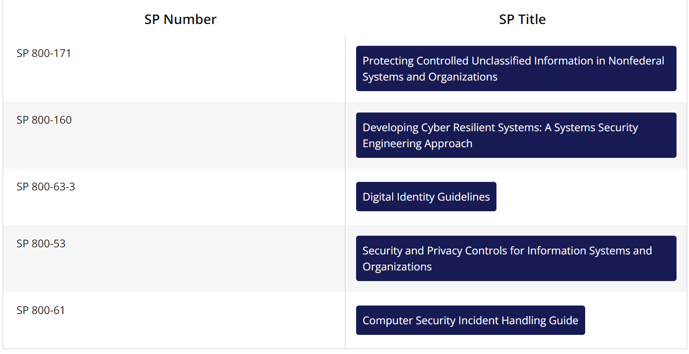

# NIST CSF

The NIST Cybersecurity Framework helps to simplify the process of maturing an organization’s cybersecurity program.

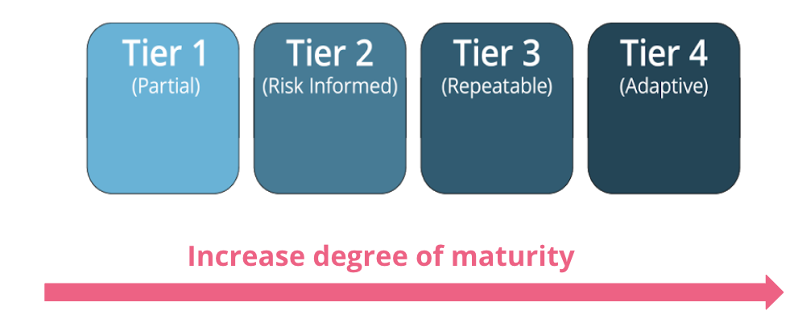

*The Framework Tiers describe how mature an organization is when it comes to cybersecurity technology, management, and operational practices.*

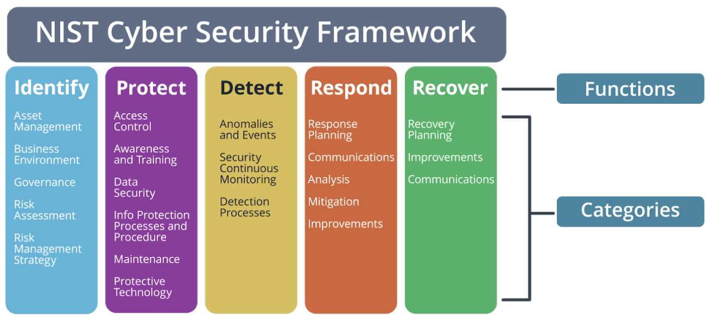

The CSF Core is a set of cybersecurity activities organized into high-level functions and categories. Using non-technical and straightforward language, it provides a translation layer among multi-disciplinary teams.

***The NIST CSF organizational Profile forms the company’s unique alignment of business objectives, threats, risks, and requirements. By comparing the current profile with a target profile, the company can identify the area to improve the cybersecurity.***

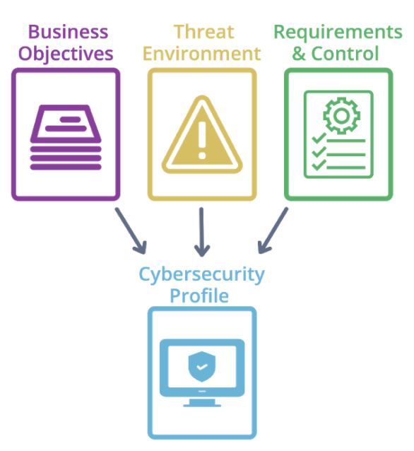

## NIST CSF Core - Functions
The NIST CSF five Functions or steps are Identify, Protect, Detect, Respond, and Recover.

- Identify valuable company assets and data.
- Protect valuable company assets and data from threats.
- Detect when a cyber incident occurs.
- Respond quickly and efficiently to a cyber incident.
- Recover from an incident and get back to business

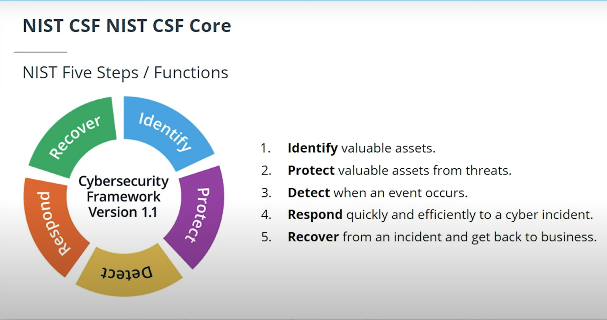

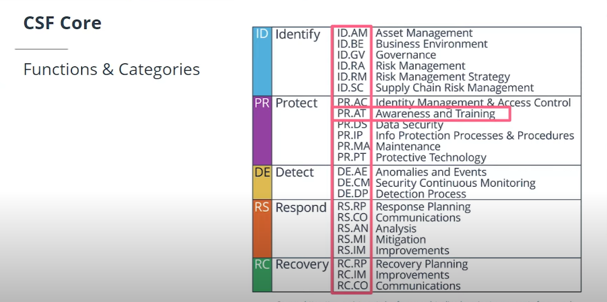

# Center for Internet Security Best Practices

Their best practices are made up of two parts:

- The Critical Security Controls, also known as the CIS CSC or CIS Controls which are the top 20 activities for organizational security.
- The CIS Benchmarks™ are guidelines to secure or lockdown operating systems, software, applications and networks

 **The CIS Controls™ is separated into three functional areas that the CIS calls Implementation Groups**:

- Basic Controls
- Foundational Controls
- Organizational Controls

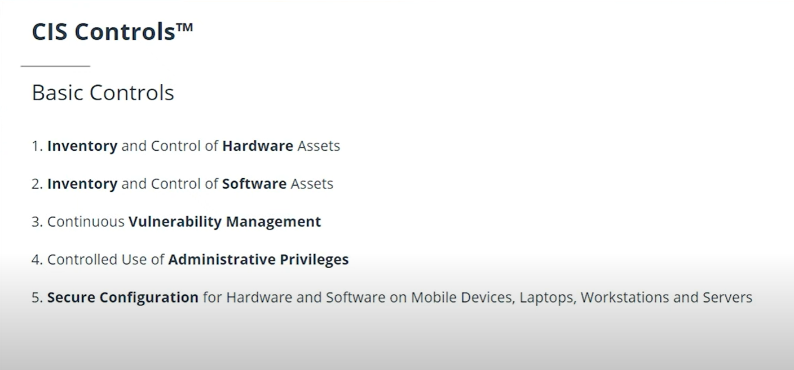

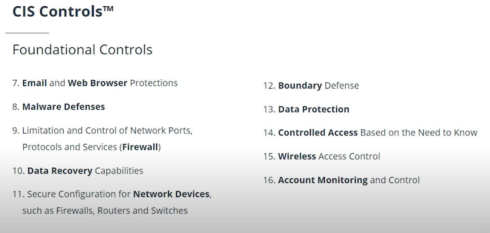

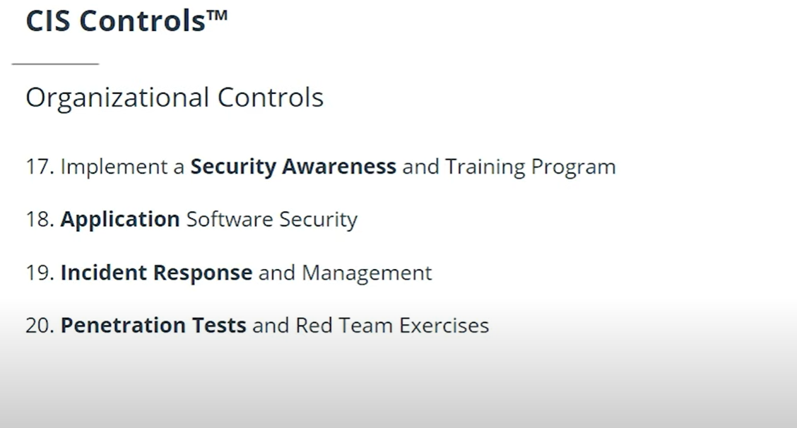t

# Think like a Hacker

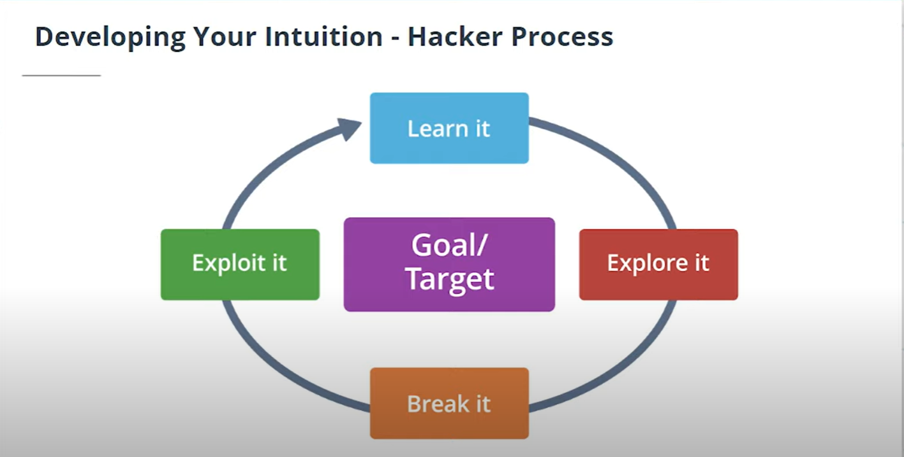
  

# Vulnerability Management

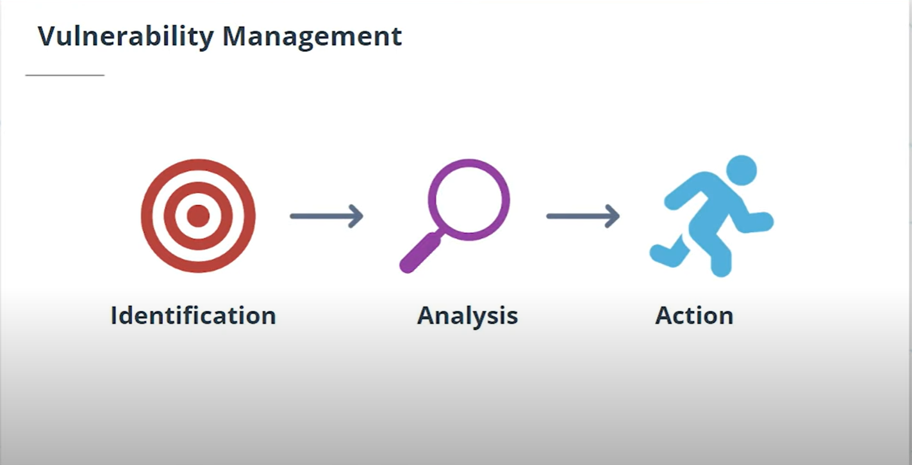

# Glossary
- **Asset**: A major application, general support system, high impact program, physical plant, mission-critical system, personnel, equipment, or a logically related group of systems.
- **Vulnerability**: Weakness in an information system, system security procedures, internal controls, or implementation that could be exploited or triggered by a threat.
- **Threat**: Any circumstance or event with the potential to adversely impact organizational operations (including mission, functions, image, or reputation), organizational assets, individuals, other organizations, or the Nation through an information system via unauthorized access, destruction, disclosure, modification of information, and/or denial of service.
- **Exploit**: A hardware or software tool designed to take advantage of a flaw in a computer system, typically for malicious purposes such as installing malware.
- **Risk**: A measure of the extent to which an entity is threatened by a potential circumstance or event, and typically a function of: (i) the adverse impacts that would arise if the circumstance or event occurs; and (ii) the likelihood of occurrence.
- **Attack**: Any kind of malicious activity that attempts to collect, disrupt, deny, degrade, or destroy information system resources or the information itself.
- Penetration Testing: A test methodology in which assessors, typically working under specific constraints, attempt to circumvent or defeat the security features of an information system.      
 
 
# Security Defenses

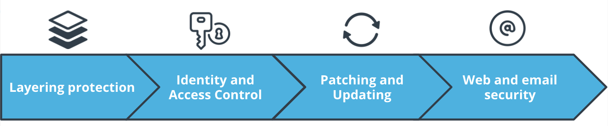

# Layering Protection

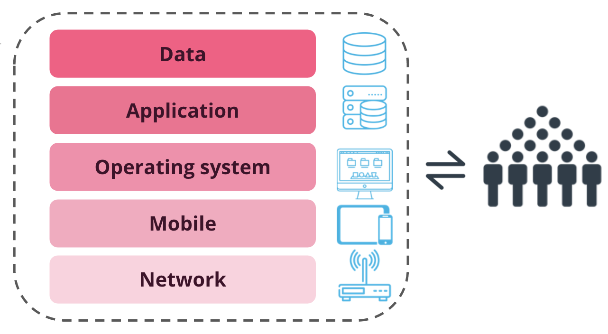

# Multi Factor Auth:
This is **MFA**.
- What you know
- what you are
- what you have

**Patch**: A software or code revision, is used to fix some type of issue, whether it’s with functionality, security or to add new features

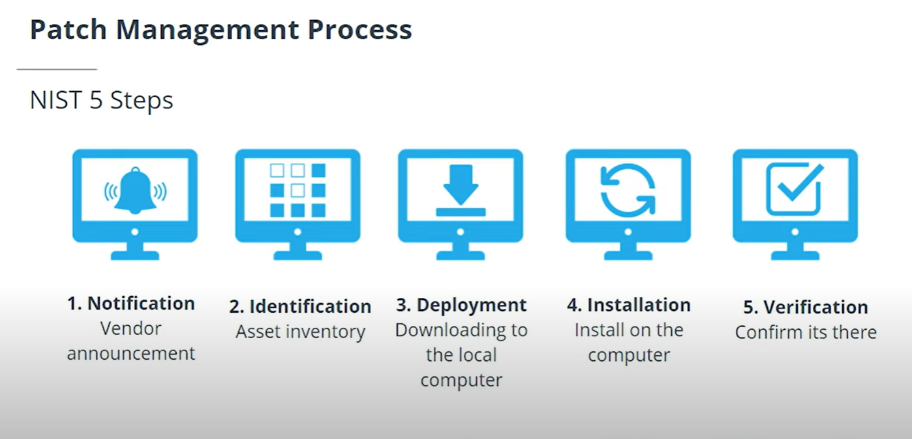