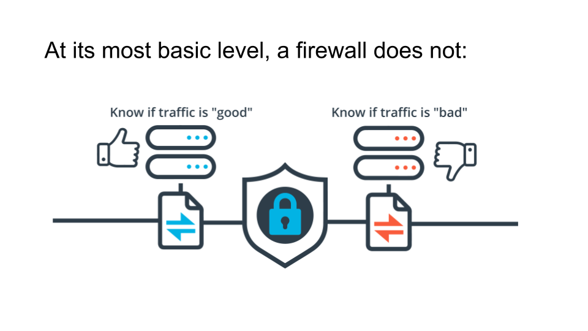
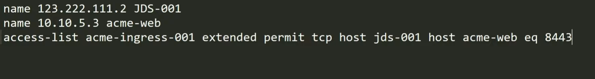
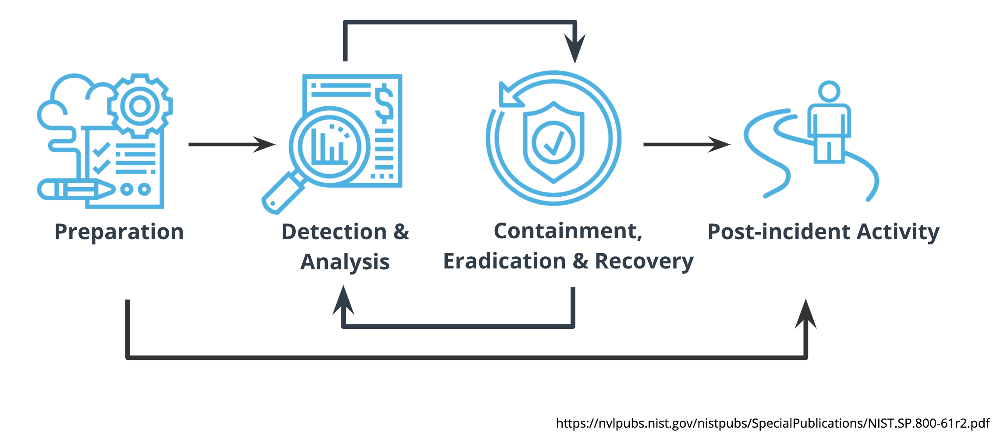
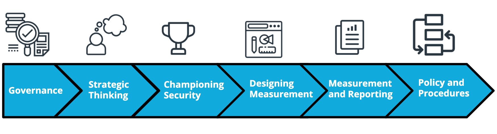

# Cybersecurity

# History of Computer Viruses and Worms

With the start of the Internet in the late 1960s, known then as the ARPANET came a need to secure the data, connections, and computer systems for those using it; mostly research institutions, universities, and governments. Computers in the early days of the Internet often didn’t have basic protection and used telephone modems to dial-into the network. Highlights of memorable computer viruses and worms include:

- 1968 - Development of the ARPANET (early Internet)
- 1971 - First reported computer worm - Creeper
         - It didn't affect any computer but it displays message on screen stating,"I am a creeper , catch me if you can"
- 1986 - Brain MS-DOS virus
- 1989 - Morris Worm - Internet Denial of Service
- 2000 - ILOVEYOU Worm  ( written in VB script using social engineering infected millions within hour of realese)
- 2010 - Stuxnet

# Timeline of Computer Viruses, Mapcon

- 1975 - “The Protection of Information in Computer Systems” published
- 1983 - RSA Patent
- 1986 - The Cuckoo’s Egg and Clifford Stoll
- 1986 - US Computer Fraud and Abuse Act (CFAA)
- 1990 - UK Computer Misuse Act
- 2001 - Advanced Encryption Standard (AES) established by NIST

***In September of 1983 when MIT was granted a patent that introduced the RSA (Rivest-Shamir-Adleman) algorithm, which was one of the first public key cryptosystems***

# Security Trends

* **Phishing**: A technique for attempting to acquire sensitive data, such as bank account numbers, through a fraudulent solicitation in email or on a web site, in which the perpetrator masquerades as a legitimate business or reputable person.   
* **Malware**: Software or firmware intended to perform an unauthorized process that will have an adverse impact on the confidentiality, integrity, or availability of an information system. A virus, worm, Trojan horse, or other code-based entity that infects a host. Spyware and some forms of adware are also examples of malicious code.    
* **Ransomware**: A type of malicious software designed to block access to a computer system until a sum of money is paid.    
* **Business Email Compromise**: An exploit in which an attacker obtains access to a business email account and imitates the owner's identity, in order to defraud the company and its employees, customers or partners.    
* **Internet of Things**: The interconnection via the Internet of computing devices embedded in everyday objects, enabling them to send and receive data.

   

[World Biggest Data breaches visulization](https://informationisbeautiful.net/visualizations/worlds-biggest-data-breaches-hacks/)

From the 2020 Verizon Data Breach Investigations Report:

- 70% of attacks were perpetrated by outsiders and 34% involved internal actors.
- 45% of breaches featured Hacking, 22% included social attacks, and 17% involved malware. 86% of the breaches were financially motivated
- 72% of victims were large businesses and 28% were small businesses.  
***Even though these values change over time, the general concepts have remained steady. Take time to understand this report as it's used throughout the cybersecurity industry.***

# Cybersecurity Skills Gap
- 66 % say it's difficult to retain cybersecurity talent

Link for the website:  
[Cybersecurity pathways](https://www.cyberseek.org/pathway.html)

# Security Principles

* Economy of mechanism -> Economy of Mechanism means to keep things small and simple.
* Fail-safe defaults
* Complete mediation
* Open design
* Separation of privilege
* Least privilege
* Least common mechanism
* User-friendly interface    

   

# Rules Governing Cybersecurity
- In the United States, that organization is the National Institute of Standards and Technology, also known as NIST.   
- The International Organization for Standards or ISO works with the International Electrotechnical Commission or IEC to set worldwide technology standards.   
- There are also governing bodies that set the rules for specific areas. For example, the Payment Card Industry (PCI) has the Data Security Standards that are required for any business accepting or handling credit card data.   

# Governance and Compliance

- Governance - A strategic planning responsibility providing organizational oversight that sets policies and establishes practices to enforcement.   
- Compliance - Requirement all affected parties follow the same rules.   
- Audit - Independent review and examination of records and activities to assess the adequacy of system controls, to ensure compliance with established policies and operational procedures. (NIST Glossary)   

- Policies are the bedrock of a security program. Policies are: 
   - Formal statements, rules or assertions that specify the correct or expected behavior of an entity.
   - Example: Acceptable Use Policy (AUP)
   - Enforcement and compliance
   - Written and accessible

# Security Frameworks
## ISO 27000 Series

1. ISO/IEC 27002:2013, The Code of Practice for Information Security Management
2. ISO/IEC 27002:2013, The Code of Practice for Information Security Management  
   - 14 security control groups
   - 35 control objectives
   - More than 110 individual controls

3. ISO/IEC 27005:2011, ISMS Risk Management

# Industry-Specific Regulations
1. HIPAA Security and Privacy rules - Safeguarding Protected Health Information (PHI)
2. Payment Card Industry Data Security Standard (PCI DSS) - Rules for processing, storing or transmitting Cardholder Data
3. European Union’s General Data Privacy Regulation (GDPR) - EU’s law on data protection and privacy

# NIST Special Publications SP 800 Series

# NIST CSF

The NIST Cybersecurity Framework helps to simplify the process of maturing an organization’s cybersecurity program.

*The Framework Tiers describe how mature an organization is when it comes to cybersecurity technology, management, and operational practices.*

The CSF Core is a set of cybersecurity activities organized into high-level functions and categories. Using non-technical and straightforward language, it provides a translation layer among multi-disciplinary teams.

***The NIST CSF organizational Profile forms the company’s unique alignment of business objectives, threats, risks, and requirements. By comparing the current profile with a target profile, the company can identify the area to improve the cybersecurity.***

## NIST CSF Core - Functions
The NIST CSF five Functions or steps are Identify, Protect, Detect, Respond, and Recover.

- Identify valuable company assets and data.
- Protect valuable company assets and data from threats.
- Detect when a cyber incident occurs.
- Respond quickly and efficiently to a cyber incident.
- Recover from an incident and get back to business

# Center for Internet Security Best Practices

Their best practices are made up of two parts:

- The Critical Security Controls, also known as the CIS CSC or CIS Controls which are the top 20 activities for organizational security.
- The CIS Benchmarks™ are guidelines to secure or lockdown operating systems, software, applications and networks

 **The CIS Controls™ is separated into three functional areas that the CIS calls Implementation Groups**:

- Basic Controls
- Foundational Controls
- Organizational Controls

t

# Think like a Hacker

  

# Vulnerability Management

# Glossary
- **Asset**: A major application, general support system, high impact program, physical plant, mission-critical system, personnel, equipment, or a logically related group of systems.
- **Vulnerability**: Weakness in an information system, system security procedures, internal controls, or implementation that could be exploited or triggered by a threat.
- **Threat**: Any circumstance or event with the potential to adversely impact organizational operations (including mission, functions, image, or reputation), organizational assets, individuals, other organizations, or the Nation through an information system via unauthorized access, destruction, disclosure, modification of information, and/or denial of service.
- **Exploit**: A hardware or software tool designed to take advantage of a flaw in a computer system, typically for malicious purposes such as installing malware.
- **Risk**: A measure of the extent to which an entity is threatened by a potential circumstance or event, and typically a function of: 
  - (i) the adverse impacts that would arise if the circumstance or event occurs; and 
  - (ii) the likelihood of occurrence.
- **Attack**: Any kind of malicious activity that attempts to collect, disrupt, deny, degrade, or destroy information system resources or the information itself.
- Penetration Testing: A test methodology in which assessors, typically working under specific constraints, attempt to circumvent or defeat the security features of an information system.      
   
     
 
# Security Defenses

# Layering Protection

# Multi Factor Auth:
This is **MFA**.
- What you know
- what you are
- what you have

**Patch**: A software or code revision, is used to fix some type of issue, whether it’s with functionality, security or to add new features

***DKIM adds a digital signature to your outgoing email so that external email servers can confirm that your email is from your domain***

# History of Defending and Securing Systems

- WWII served as the Big Bang for so many areas of technology, from code machines to early computers that were designed to crack those codes.
- 1960s Universities across the country installed computers and students as well as the public (depending on the University) could use the machines.
- ARPANet Also in the 1960s the US Government began networking some of these University computers together, creating the internet.
- 1980s Introduced the rollout of commercial internet and began what we now know as modern networking.
- 1990s is where the industry exploded. The arrival of 'high-speed' internet in businesses and dial-up in homes. Windows 95 and 98 saw a rapid rise in computers at home. Also in the 1990s, the cell phone became commonly available.
- 2000s The first decade of the millennium brought high speed internet into the home and a smart phone in the pocket of millions. The phishing email exploded in prevalence and hacking became an industry.

# Defense in Depth

- Framework: A set of agreed-upon policies, procedures, and processes that define how information is managed.
- Best Practices: procedures and processes that are widely accepted within an industry as being effective.
- Vendor Documentation: A combination of requirements and suggestions for the specific security configuration of their product.
Regulatory Requirements: Laws that you must comply with.     

- Defense in Depth is using complementary layers of defenses to protect your organization.

## NIST 800 Framework

- NIST-800: NIST’s 800 series presents information of interest to the computer security community. The series comprises guidelines, recommendations, and technical specifications.
- NIST CSF: The Framework is voluntary guidance, based on existing standards, guidelines, and practices for organizations to better manage and reduce cybersecurity risk.

# Stateless vs Stateless firewall

## Principle of Least Privilege: is the idea that any user, program, or process should have only the bare minimum privileges necessary to perform its function.

**Note - The Principle of Least Privilege (PoLP) is one of the most important concepts in this course. It applies to nearly every component you will see in cyber security.**

KeyTerm | Definition
--- | --- 
Framework | A set of agreed-upon policies, procedures, and processes that define how information is managed.
NIST CSF | The Framework is voluntary guidance, based on existing standards, guidelines, and practices for organizations to better manage and reduce cybersecurity risk.
NIST-800 | NIST’s 800 series presents information of interest to the computer security community. The series comprises guidelines, recommendations, and technical specifications.
Principle of Least Privilege |is the idea that at any user, program, or process should have only the bare minimum privileges necessary to perform its function.
 |

# Firewall

- **Firewall**: is a network device that monitors and controls incoming and outgoing traffic.

- **Intrusion Detection System**: is a device or application that monitors traffic for malicious activity or policy violations.

- **Blocklist**: In computing, a denylist or blocklist is a basic access control mechanism that allows through all elements except those explicitly mentioned. Those items on the list are denied access.
- **Automation**: is the application of technology in the form of applications or processes to perform tasks, generally repetitive or time-consuming, with minimal human input.
- **URL**: Uniform Resource Locator or web address.

# IDS/IPS Systems
 

      

# System Event Logs
 3 Primary Categories of Event Logs in Windows
- System The System event log is for general system events, Services starting and stopping etc.
- Security The Security event log is for login attempts and permissions events.
- Application The Application log is for events associated specifically with applications. Think Office or Adobe.

# SIEM Framework

SIEM Security Information and Event Management, it is an application that serves as a log aggregator and, more importantly, analyzes the logs to allow alerting, dashboard creation and efficient queries to run.

SIEMs allow you to retain your log data for much longer. In particular, networking equipment do not typically have much storage and logs are overwritten frequently.

Considerations when choosing your SIEM solution:

- Licensing what is the licensing model? Is it based on users, nodes or volume of events?
- Scalability should your organization experience rapid growth, can the solution keep up?
- Dashboards What built-in dashboards are included? How difficult is it to customize existing and make new dashboards?
- Alerts Is the solution capable of real-time alerting?
- Query Language From an analyst point of view this may be the most important, how complicated is the query language and is there plentiful documentation available?

# Encryption
**Encryption**: is the process that converts plaintext, or text that can be read by anyone, into ciphertext and it can only be read by the person who has the secret code, or decryption key.

# Encryption

KeyTerm | Definition
--- | --- 
HTTP/TLS | Processing or hosting sensitive data accessible from the internet
SSH | Hosting servers (particularly Linux) to execute commands and process jobs
SFTP or FTPS | Hosting files for others to download (Choice depends on the configuration of the host they reside on)
Encryption at Rest| For additional security, consider using on files that are to be accessed via SSH or SFTP/FTPS

# Hash
**File Hash**: is the process of using an algorithm for verifying the integrity of a computer file.

**Collision**: is a situation that occurs when two distinct pieces of data have the same hash value.

- It is not encryption. Hashing is a one-way function.  
**Common Types of Hashes**:
- MD5 Message Digest 5 - mainly retired due to collisions which are the risk of a duplicate hash.
SHA2 Secure Hashing Algorithm 2. When you think SHA256, this is it.

***While sensitive or restricted data absolutely must be encrypted, regular email traffic generally isn't. However, your organization may be different but personal email traffic remains unencrypted for the most part.***

# Assessing Threats

- **Threat**: Any circumstance or event with the potential to adversely impact organizational operations (including mission, functions, image, or reputation), organizational assets, or individuals through an information system via unauthorized access, destruction, disclosure, modification of information, and/or denial of service. Also, the potential for a threat-source to successfully exploit a particular information system vulnerability.

- **Vulnerability**: Weakness in an information system, system security procedures, internal controls, or implementation that could be exploited or triggered by a threat source.

There are 7 common steps in the Cyber Attack Process, first articulated by Lockheed Martin as the cyber attack kill chain:

1. Reconnaissance: The threat actor conducts research to find as much information as possible on the targets they want to attack, including vulnerabilities and weaknesses.
2. Weaponization: The threat actor creates or acquires the arsenal for attack, such as malware.
3. Delivery: The weapon is launched against the target and the operation begins.
4. Exploitation: The threat actor must take advantage of vulnerability to gain access.
5. Installation: The threat actor might install a backdoor or create ways to keep their access for the attack.
6. Command and control: The threat actor enables remote control and manipulation of the target.
7. Action on objectives: The threat actor accomplishes their mission and completes the attack goal.

***Penetration testing*** is another level of actively trying to see if you can essentially break security. Penetration tests can target networks, hosts, people, and physical assets.

**Penetration testing**, also known as ***pen*** testing, is a method of vulnerability discovery where ethical hackers target a resource to determine whether vulnerabilities can be exploited to compromise and environment or asset. These tests can target all resources from technology devices and networks, to physical offices and even employees via social engineering tests.

## Red Team vs Blue Team
Penetration tests include two sides that are categorized as teams. One side is the offensive team (red team) who are pretending to be the “bad” actors launching attacks. The other is the defensive team (blue team) who is acting as the “good” side trying to prevent attacks.

- **White box testing**: A test methodology that assumes explicit and substantial knowledge of the internal structure and implementation detail of the assessment object.

- **Black box testing**: A test methodology that assumes no knowledge of the internal structure and implementation detail of the assessment object.

- **Gray box testing**: A test methodology that assumes some knowledge of the internal structure and implementation detail of the assessment object.

# Contingency Planning

Contingency Planning is the process of preparing a company to detect, react to, and recover from threats to assets. The main goal is to bring the company back to a state of normal operations following a disruptive event.

There are 3 key parts to contingency planning:

- **Incident Response**: The process of detecting and responding to to limit consequences of a malicious, unintentional, or circumstantial cyber attack against an organization’s information systems(s).

- **Business Continuity**: A predetermined process that describes how an organization’s mission/business processes will be sustained during and after a significant disruption.

- **Disaster Recovery**: A predetermined process that details how critical applications and processes will be restored to normal operations at the primary business site in the event of a major hardware or software failure or destruction of facilities.

# Incident Response Life Cycle

Though the details and nature of incidents may vary, all typically follow a standard response process organized in several phases:
- Preparation
- Detection and analysis
- Containment
- Eradication and recovery
- Post-incident activity

# Internal Incident Response Team

# External Incident Response Team

# What is digital forensics?
Digital forensics is the application of computer science and investigative procedures involving the examination of digital evidence. The process includes collecting, preserving, analyzing, and reporting on evidence.

# Digital Forensics Process

# GRC (Security Governance, Risk, and Compliance)

## Two GRC

- ***Operational GRC***
- ***Security GRC*** is the integrated collection of capabilities that enable an organization to set and meet strategic goals, address existing and emerging threats, and meet obligations as they relate to security.

## Security controls can be categorized in 1 of 3 ways:

1. Detective
2. Preventive
3. Reactive.

## In fact, in larger organizations, there are generally full departments dedicated to each role.

***Governance professionals***, for instance, are responsible for two major tasks:

- They act as a bridge between security and the organization
- They ensure the effectiveness of existing security controls.

***Risk professionals*** are responsible for:

- Identifying security risks to the organization
- Working with stakeholders to treat the risk.

***Compliance professionals*** are responsible for:

- Ensuring that the organization is complying with security compliance obligations
- Working with stakeholders to remediate compliance failure

 
 

# Governance 

# Risk

Risk statements should be:

- Concise
- Specific
- And focused on an action that is or is not being performed

# Step in the NIST RMF

* Step 1: Categorize Information System
The system owner assigns a security rating to an IT system of data based on mission and business objectives.

* Step 2: Select Security Controls
Security controls for the data or system are selected and approved by leadership.

* Step 3: Implement Security Controls
Install, configure, and, etc. the selected security controls.

* Step 4: Assess Security Controls
Security tools are assessed and any deficiencies are remediated.

* Step 5: Authorize Information System
A risk assessment and risk determination are made about the system and whether it is able to operate given the risk, the system’s categorization, and risk level following the implementation of controls.

* Step 6: Monitor Security Controls
Security controls are monitored and improved upon continuously.

# Another Framework

[Value-At-Risk Models](https://www.fairinstitute.org/blog/what-is-a-cyber-value-at-risk-model)

Typically, there are 5 options for risk treatment:

* Accept - Accept the risk without taking any further action.
* Modify - Implement a control that lessens or changes the risk in some way.
* Avoid - Choose to do something altogether different.
* Transfer - In most cases cybersecurity risk transference means insuring against the risk occurring through a cybersecurity insurance policy or creating a shared liability model with a vendor.
* Capitalize – The capitalize option is normally reserved for financial or business risk where there is opportunity to take on additional risk for potential gains

# Compliance

**Audit**: An evaluation of whether processes and procedures are operating as expected

